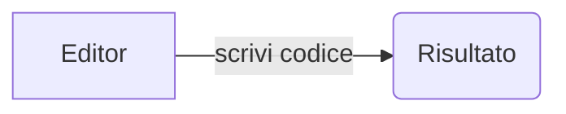

[Mermaid] è un software che permette di realizzare vari tipi di diagrammi in modo testuale. L'ho scoperto mentre cercavo di realizzare alcuni diagrammi UML per lavoro. Dopo essere passato da vari editor visuali installati su PC (Windows e Linux) ed averne provati alcuni online, dopo aver usato [PlantUML], alla fine sono arrivato a [Mermaid].

Mermaid è un altro tassello alla mia personale filosofia "Everything is code" in cui sostanzialmente tutto si realizza scrivendo codice o al più pseudocodice, con la conseguenza che per realizzare qualsiasi cosa, l'unico tool necessario è un editor.

Per questo per realizzare un diagramma si scrive qualcosa tipo questo:



E si ottiene:


graph LR
    A[Editor] --> | scrivi codice | B(Risultato)


## Considerazioni sull'editing

Uno dei motivi per cui ho scelto Mermaid è legato al fatto che si integra molto bene con markdown, ed è quindi compatibile con la mia catena di produzione di contenuti basata (per il markdown) su Visual Studio [Code]. Per inserire un diagramma Mermaid dentro un documento markdown, basta inserire il codice Mermaid dentro un blocco di codice:

````

````

Per vedere i diagrammi direttamente dentro Code mentre si scrivono, è sufficiente installare il plugin [Markdown Preview Mermaid Support] e aprire la finestra di preview markdown.

## Convertire i diagrammi

Per convertire i diagrammi in immagini si può utilizzare [mermaid-cli].
All'interno di questo pacchetto esiste il comando `mmdc` che prende un file con codice Mermaid valido e genera vari tipi di file.

Siccome però come abbiamo visto capita che i diagrammi Mermaid siano all'interno di file Markdown, per evitare tutte le volte di estrarli a mano ho scritto un semplice programmino bash+awk che fa tutto il lavoro: dato un file markdown contenente immagini Mermaid, il seguente programma, **`extract_mermaid.sh`**, estrae gli spezzoni Mermaid e genera tanti PNG, uno per diagramma:

```bash
#!/usr/bin/env bash

myfullname=$(realpath "$0")
mydir=$(dirname "$myfullname")
myname=$(basename "$myfullname")
outdir="mermaid_diagrams_images"

awk_file="$mydir"/extract_mermaid.awk

if [ $# -lt 1 ]; then
    echo "usage: $myname <file_to_process> [mermaid-cli options]"
    exit 1
fi

file_to_process="$1"
shift
mc_options="$*"

if [ ! -f "$file_to_process" ]; then
    echo "File $file_to_process does not exists or it is not a regular file"
    exit 1
fi

mmdc_cmd=$(which mmdc > /dev/null 2>&1)
if [ "$?" -ne 0 ]; then
    echo "unable to find mmdc command. Is mermaid-cli installed? (and bin in the path)"
    exit 1
fi

echo "Extracting diagrams from file $file_to_process. Images are saved in $outdir"
echo "awk -f $awk_file $file_to_process"
awk -f "$awk_file" "$file_to_process"

rm -rf "$outdir"
mkdir -p "$outdir"

for mf in mermaid_diagram_*.md; do
    fnoext="${mf%.*}"
    imgfile="$outdir"/"$fnoext".png
    echo "mmdc $mc_options -i $mf -o $imgfile"
    eval mmdc "$mc_options" -i "$mf" -o "$imgfile"
done
```

Il programma fa uso del seguente script `awk`, **`extract_mermaid.awk`**:

```awk
BEGIN {
    inmerm = 0
    fileindex = 0
}
{
    if (inmerm == 0) {
        if ($1 == "```mermaid") {
            inmerm = 1
            ++fileindex
            filename = sprintf("mermaid_diagram_%02d.md", fileindex)
            print "Mermaid code found, saving to file = " filename
        }
    }
    else {
        if ($1 == "```") {
            inmerm = 0
        }
        else {
            print > filename
        }
    }
}
```

## Pubblicare i diagrammi sul web

L'unico modo che ho studiato per capire come pubblicare i diagrammi sul web usando direttamente il codice e non le immagini è usare Hugo.

Per inserire un diagramma Mermaid in una pagina Hugo si utilizzano gli shortcode, in particolare, per il caso in esame, i custom shortcode.

I passi da compiere sono i seguenti:

- Aggiungere il custom shortcode all'interno della directory `layouts/shortcodes`. Il file si deve chiamare `mermaid.html` e deve contenere il seguente codice:

```html
<div class="mermaid">
  {{.Inner}}
</div>
```

- Aggiungere il caricamento dello script javascipt necessario per far funzionare Mermaid aggiungendo il seguente codice nell'appropriato file html dentro la directory `layouts/_default` (dipende dal tema):

```html
{{if (.Params.mermaid)}}
  <!-- MermaidJS support -->
  <script async src="https://unpkg.com/mermaid/dist/mermaid.min.js">
  </script>
{{end}}
```

- Aggiungere il parametro `mermaid` impostato a `true` nell'header delle pagine che contengono diagrammi:

```markdown
---
title: "Fare Diagrammi Con Mermaid"
...

mermaid: true
---
```

(Notare che questo serve solo per ottimizzare il caricamento delle pagine che non contengono diagrammi).

Ed ecco, per chiudere, un esempio di diagrammi che si possono ottenere con Mermaid, in questo caso un sequence diagram UML:


sequenceDiagram
participant OP as OCC Operator
participant OCC
participant T as TETRA RADIO
participant CU
participant MEDIA
participant HMI
participant DRIVER

%% ------------------------------------------------------------------------------------------
rect rgb(255, 253, 231)
    Note over OP,DRIVER: Call termination from OCC Operator
    OP->>OCC: Terminate call
    par OCC TO TRAIN 1
        rect rgb(178, 235, 242)
            OCC->>T: D_RELEASE
        end
        par T to OCC
            rect rgb(178, 235, 242)
              T->>OCC: U_DISCONNECT
            end
            OCC->>OP: Call closed
        and T to CU
            T->>CU: PEI Call Terminated
            par CU to MEDIA
                CU->>MEDIA: CU_TO_MEDIA_M
                Note over CU,MEDIA: CU_TO_MEDIA_StsW.Call_Act = 0
            and CU to HMI
                CU->>HMI: Call Terminated
                Note over HMI: Call notification<br/>icon: GREY
            end
        end
    and OCC TO TRAIN 2
        rect rgb(255, 235, 238)
            rect rgb(178, 235, 242)
                OCC->>T: D_RELEASE
            end
            par T to OCC
                rect rgb(178, 235, 242)
                  T->>OCC: U_DISCONNECT
                end
                OCC->>OP: Call closed
            and T to CU
                T->>CU: PEI Call Terminated
                par CU to MEDIA
                    CU->>MEDIA: CU_TO_MEDIA_M
                    Note over CU,MEDIA: CU_TO_MEDIA_StsW.Call_Act = 0
                and CU to HMI
                    CU->>HMI: Call Terminated
                    Note over HMI: Call notification<br/>icon: GREY
                end
            end
        end
    end
end
Note over OP,DRIVER: NOTE: Drivers cannot terminate the call


[Mermaid]: https://mermaid-js.github.io/mermaid/#/
[PlantUML]: https://plantuml.com/
[Vim]: https://www.vim.org/
[Code]: https://code.visualstudio.com/
[Markdown Preview Mermaid Support]: https://marketplace.visualstudio.com/items?itemName=bierner.markdown-mermaid
[mermaid-cli]: https://github.com/mermaid-js/mermaid.cli